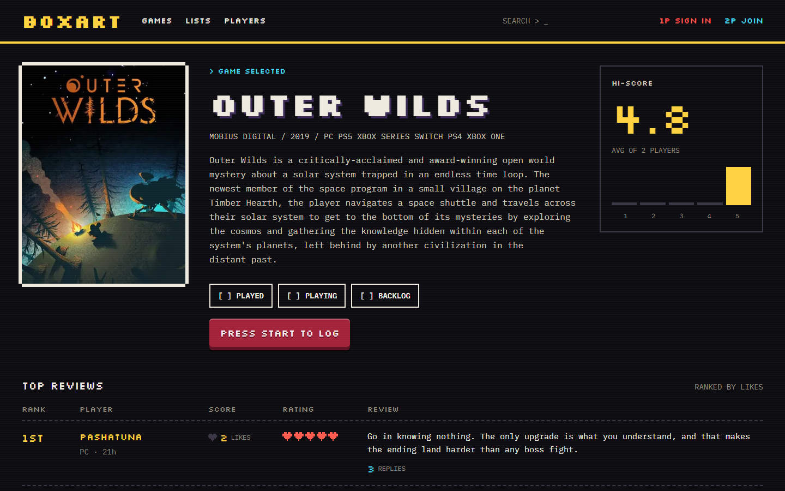
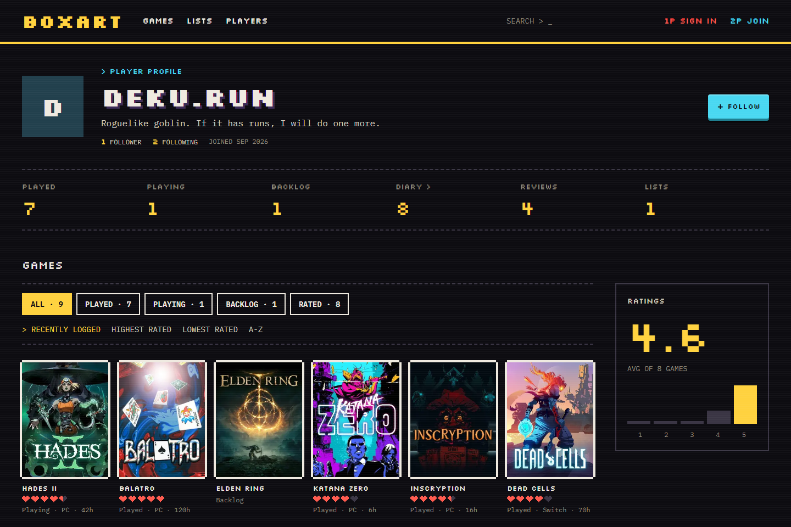
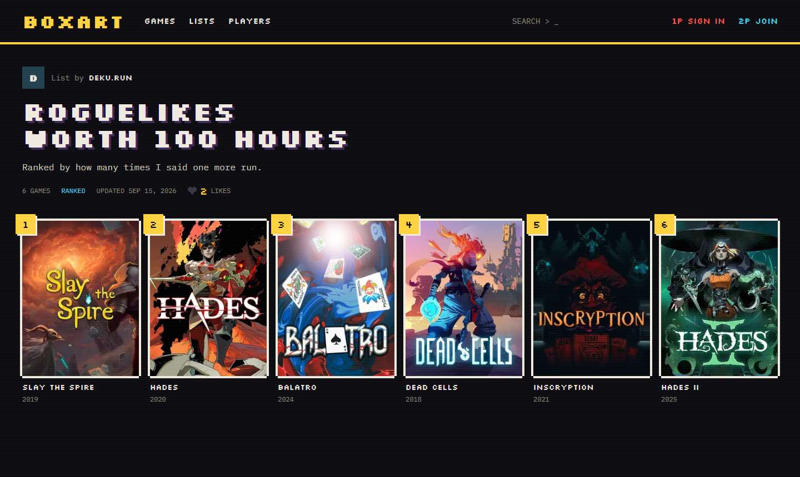
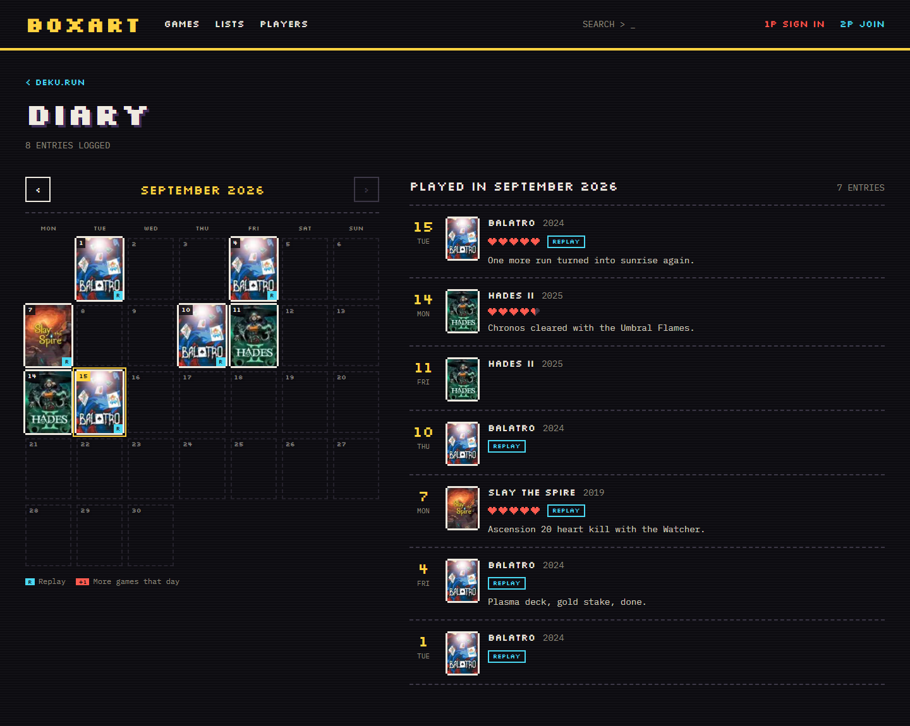
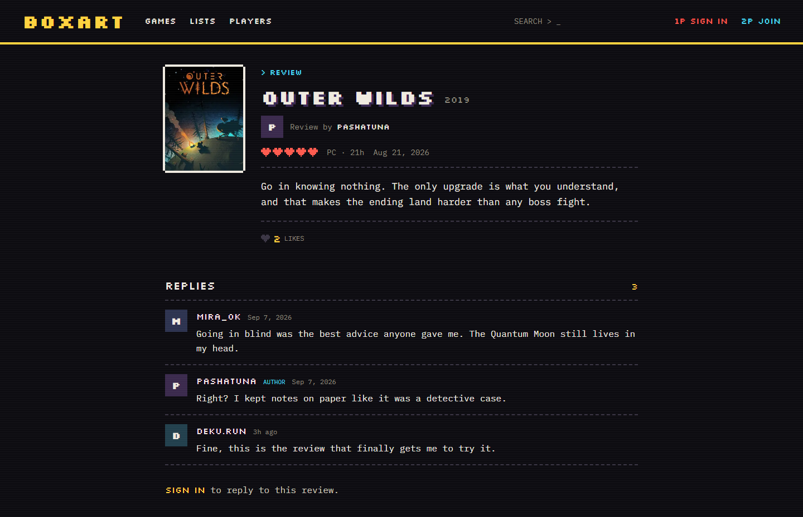
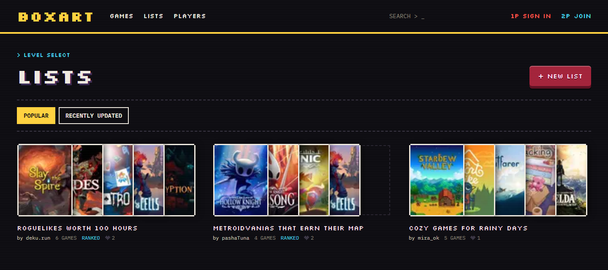

# Boxart

A social diary for the games you play. Log what you played, rate it with hearts, post reviews to a high-score table and collect games into lists.

Boxart is a portfolio project in the spirit of Letterboxd, built for games. Its look borrows from arcade attract screens: pixel type, scanlines, heart containers and a scoreboard for reviews.

**Live site:** [boxart-seven.vercel.app](https://boxart-seven.vercel.app)



| Player profile | Ranked list |
| --- | --- |
|  |  |

| Diary | Review thread |
| --- | --- |
|  |  |



## Features

- **Game catalogue** from IGDB with popular, top rated and newest sorting, genre filters and search.
- **Game pages** with the cover, details, a Boxart average score, a rating histogram and the most liked reviews.
- **Shelves.** Mark a game as played, playing or backlog. You can add a half-heart rating, platform, hours played and a review.
- **Diary.** Log the day you played a game, mark replays and add a short note. Each player's diary is a monthly calendar, and game pages show how often you played.
- **Review threads.** Every review has its own page where players reply, and authors can remove replies on their reviews.
- **Likes** on reviews and lists, updated optimistically.
- **Lists.** Players can make ranked or unranked lists, add games from search or from a game page, reorder and remove them.
- **Profiles** with every logged game in shelf tabs, sorting, a ratings panel, reviews, lists and a bio, plus a player directory that you can sort and search.
- **Follows.** Players follow each other, see what friends logged, rated, reviewed and listed in a feed on the home screen, and see which friends played a game on its page.
- **Notifications** for new followers, replies and likes on reviews and lists, with a bell in the header and a follow back button.
- **Accounts** with email and password or Google, a keep me signed in option and a first-run step to pick a username.

## Stack

| Area | Choice |
| --- | --- |
| Framework | [Next.js 16](https://nextjs.org) App Router, React 19, TypeScript |
| Styling | Tailwind CSS v4, Silkscreen and IBM Plex Mono |
| Auth and database | [Supabase](https://supabase.com): Postgres, Row Level Security, Auth |
| Game data | [IGDB API](https://api-docs.igdb.com) through a Twitch developer app |

## How it works

- **IGDB stays on the server.** IGDB calls run in server components and server actions only (`src/lib/igdb`). The Twitch token is cached in memory and responses use the Next.js fetch cache.
- **Game details are copied when saved.** Saving a game to a shelf or list stores its title, cover and release date with the entry, read from IGDB on the server. Shelves, profiles and lists render without calling IGDB again.
- **The database enforces the rules.** Every table has Row Level Security, and players can only write their own rows. Column grants limit what can be written. Triggers keep like counts, list sizes and list order in step, so the client can never set them directly.
- **Aggregates live in SQL functions.** Rating stats, batch rating summaries for cover grids and the player directory are Postgres functions called over RPC.
- **Mutations are server actions.** Pages revalidate after each change.
- **Notifications come from the database.** Triggers write a notification when someone follows a player, replies to a review or likes a review or list, and remove it again when the like or reply is taken back, so the app never has to remember to send or clean one up.
- **Tested on every push.** Unit tests cover the date, diary calendar and sign-in cookie logic. Playwright tests walk through the signed-out flows, and GitHub Actions runs lint, type checks and both test suites.

## Getting started

### 1. Install

```bash
npm install
cp .env.example .env.local
```

### 2. Supabase

1. Create a Supabase project. Put its URL and publishable key in `.env.local`.
2. Run the migrations in `supabase/migrations` in filename order, either in the SQL Editor or with the Supabase CLI.
3. Under **Authentication > URL Configuration**:
   - Set the Site URL to `http://localhost:3000`.
   - Add `http://localhost:3000/auth/confirm` as a redirect URL.
4. Optional: to enable Google sign-in, turn on the Google provider with a Google OAuth client.

### 3. IGDB

1. Register an application at [dev.twitch.tv/console](https://dev.twitch.tv/console).
2. Put its client ID and secret in `.env.local`.

These values are server-only, so they must not use the `NEXT_PUBLIC_` prefix.

### 4. Run

```bash
npm run dev
```

Open [http://localhost:3000](http://localhost:3000).

### 5. Continuous integration

GitHub Actions runs on every push. The end-to-end job needs the same four values as `.env.local`, added as repository secrets: `NEXT_PUBLIC_SUPABASE_URL`, `NEXT_PUBLIC_SUPABASE_PUBLISHABLE_KEY`, `IGDB_CLIENT_ID` and `IGDB_CLIENT_SECRET`. Without them it is skipped.

## Scripts

| Command | What it does |
| --- | --- |
| `npm run dev` | Start the development server |
| `npm run build` | Build for production |
| `npm run start` | Serve the production build |
| `npm run lint` | Run ESLint |
| `npm run typecheck` | Generate Next.js route types and run the TypeScript checker |
| `npm test` | Run the unit tests with Vitest |
| `npm run test:e2e` | Run the Playwright tests, starting the dev server if it is not running. Set `E2E_BASE_URL` to test a deployed site |

## Project structure

```
src/
  app/            Routes, server actions, metadata images
  components/     UI components
  lib/            Data access: IGDB, Supabase, shelves, lists, players
  proxy.ts        Refreshes the Supabase session on each request
e2e/              Playwright end-to-end tests
supabase/
  migrations/     Database schema, policies, triggers and functions
```

## Credits

- Game data and covers come from [IGDB](https://www.igdb.com).
- [Silkscreen](https://github.com/googlefonts/silkscreen) and [IBM Plex Mono](https://github.com/IBM/plex) are used under the SIL Open Font License. License files are in `src/app/_fonts`.
